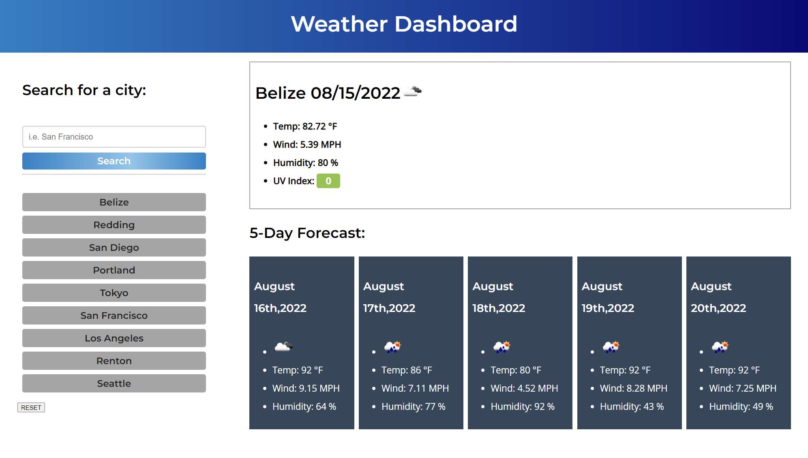

# 06-Weather-Dashboard
This is a weather application that will search current and 5 day forecast when a specified city is inputted into the form.

When a city is searched it will automatically save to the user's web browers local storage. If the user wishes to review past searches the weather forcast can be readily available.

In the event that the user would like to look at a previous entry they can select the preset box to the left.

If the user wanted to remove the city they will click the reset button to remove all previous searches.

Each city will populate live weather conditions such as temperature, humidity, wind and UV index. (All weather conditions will generally be updated within the hour.)

The displayed UV index also utilizes a color as a representation when the conditions are favorable, moderate, or severe.

This challenge was not based of any starter code but some helpful examples were presented and credited to our most recent bootcamp lecture.

With a web browser this application features dynamic and live data provided from OpenWeather One Call API(https://openweathermap.org/api/one-call-api).

As the publisher, This application is best used for those who are familiar with "imperial" system/measurements as the temperature is only displayed in fahrenheit.


Github Page: https://bsayavong.github.io/06-Weather-Dashboard/

## User Story

```
AS A traveler
I WANT to see the weather outlook for multiple cities
SO THAT I can plan a trip accordingly
```

## Acceptance Criteria

```
GIVEN a weather dashboard with form inputs
WHEN I search for a city
THEN I am presented with current and future conditions for that city and that city is added to the search history
WHEN I view current weather conditions for that city
THEN I am presented with the city name, the date, an icon representation of weather conditions, the temperature, the humidity, the wind speed, and the UV index
WHEN I view the UV index
THEN I am presented with a color that indicates whether the conditions are favorable, moderate, or severe
WHEN I view future weather conditions for that city
THEN I am presented with a 5-day forecast that displays the date, an icon representation of weather conditions, the temperature, the wind speed, and the humidity
WHEN I click on a city in the search history
THEN I am again presented with current and future conditions for that city
```


